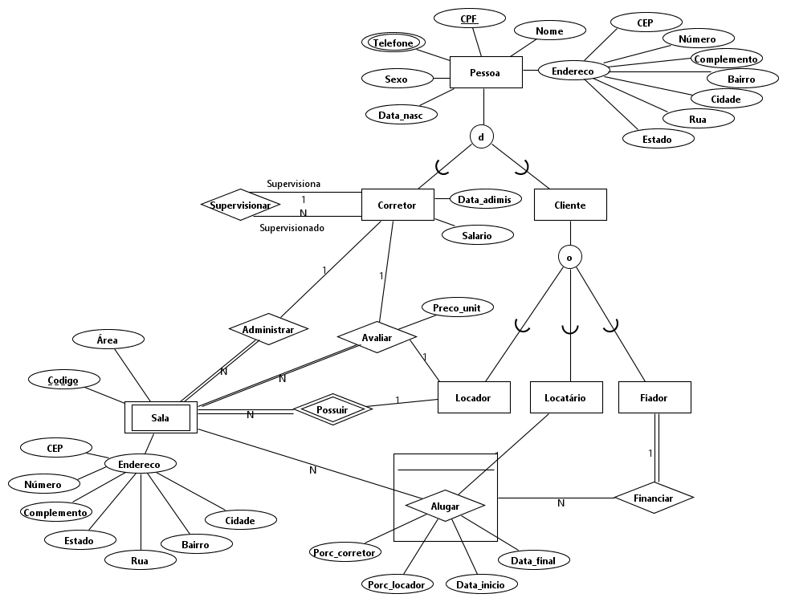

# Projetos GDI 2022

Aprendendo as etapas da criação de um banco de dados desde a modelagem até a implementação, utilizando o banco de dados Oracle e MongoDB, no qual foi seguido o seguinte caminho:
1. Especificação de minimundo
2. Instanciação do esquema conceitual (ER)
3. Criação do esquema relacional
4. Normalização do esquema relacional
5. Criação do esquema lógico (SQL)
    1. Criação das tabelas
    2. Povoamento das tabelas
    3. Consulta das tabelas
6. Adaptação de relacional para OR
    1. Criação das tabelas
    2. Povoamento das tabelas
    3. Consulta das tabelas
7. Criação de um projeto noSQL (MongoDB)
    1. Criação das tabelas
    2. Povoamento das tabelas
    3. Consulta das tabelas 

No qual foram feitos quatro projetos no total.

## Centros de diagnósticos médicos

## Alugueis de salas e lojas

